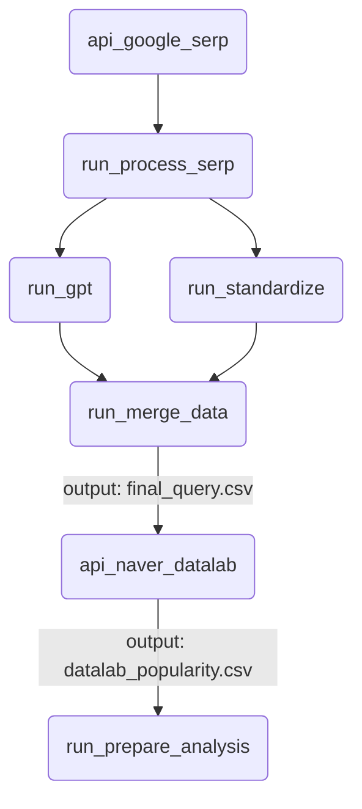

# llm-politics
 

```mermaid
   graph TD
      A(api_google_serp) --> B(run_process_serp)
      B --> C(run_gpt) --> E(run_merge_data)
      B --> D(run_standardize) --> E(run_merge_data)
      E -- output: final_query.csv --> F(api_naver_datalab) -- output: datalab_popularity.csv --> G(run_prepare_analysis)
```
```
